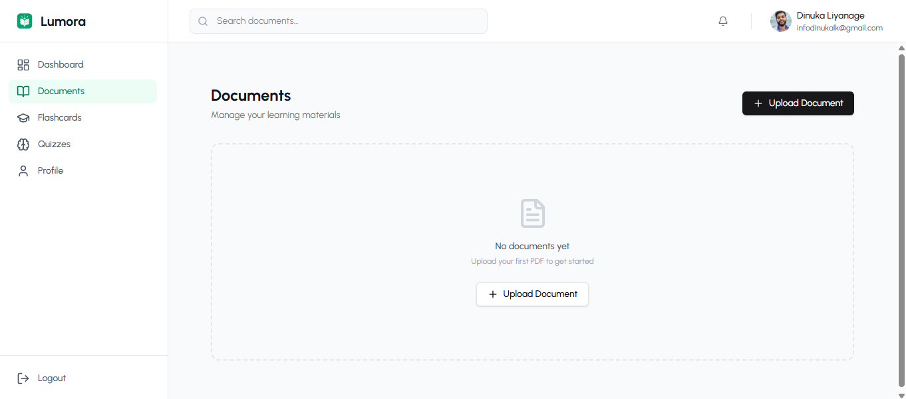
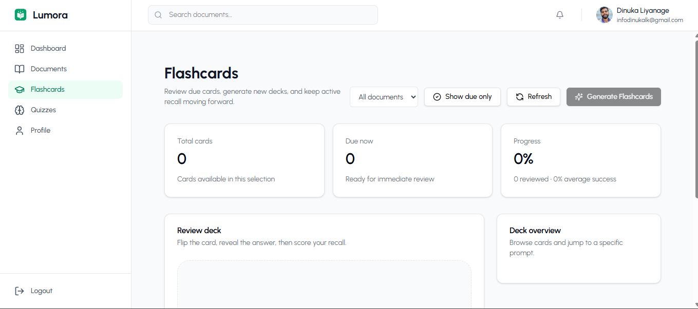
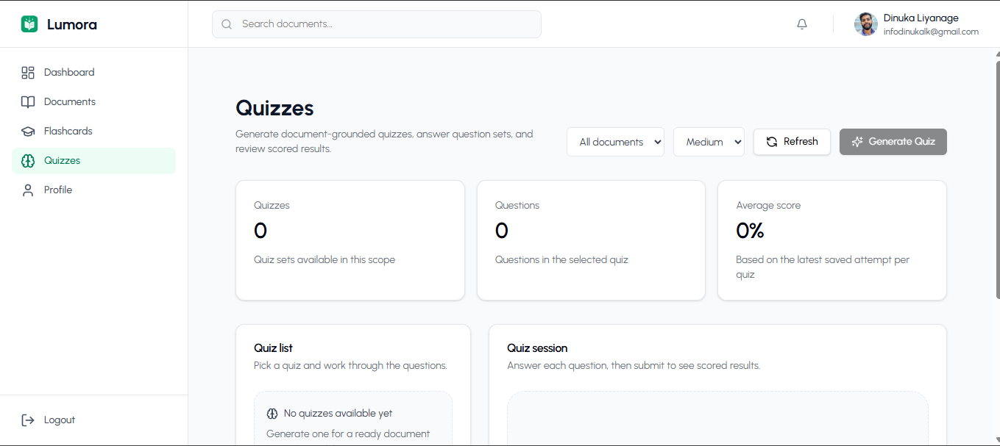
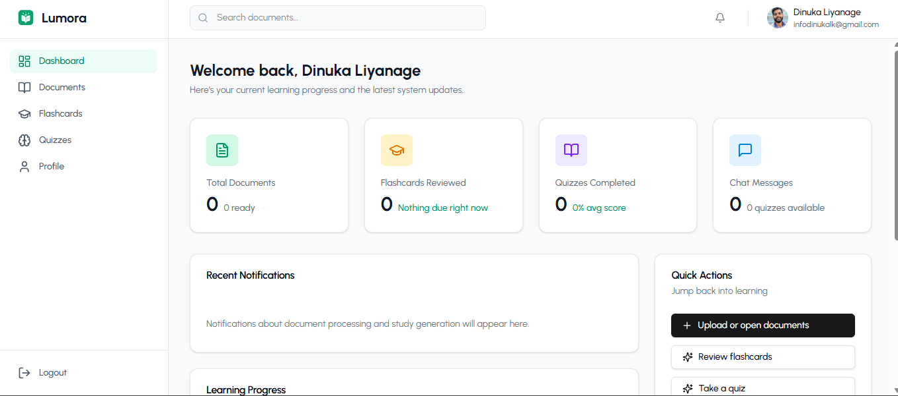

# Lumora

AI-powered learning assistant for studying from PDF documents with retrieval-grounded chat, summaries, flashcards, quizzes, progress tracking, and admin operations.

## Overview

Lumora is a full-stack learning platform that turns uploaded PDFs into interactive study workspaces. A user can upload a document, wait for background processing, and then ask grounded questions, generate study aids, review flashcards, take quizzes, and track learning progress.

The project is built as a realistic SaaS-style application rather than a small prompt demo. It includes authentication, email verification, background jobs, realtime notifications, document storage, vector retrieval, AI provider abstractions, and an admin console.

## Problem Statement

Learning from dense PDFs is slow. Students and professionals often need to search for answers, identify important concepts, convert reading material into practice, and revisit weak areas over time.

Lumora addresses this by combining document ingestion, retrieval-augmented AI, and active learning tools in one workspace.

## Implemented Features

### Learner Experience

- PDF document library with upload, listing, detail, viewing, and deletion.
- Document workspace with Content, Chat, AI Actions, Flashcards, and Quizzes tabs.
- Dashboard with learning progress data.
- Global flashcard and quiz experiences.
- Realtime notification popover and document/job status updates.

### Document Processing

- PDF-only upload validation with a 50 MB limit.
- S3-compatible object storage integration for uploaded PDFs.
- BullMQ/Redis background processing.
- Separate API and worker runtime entry points.
- Python/PyMuPDF text extraction with page-preserving output.
- Text cleaning, semantic chunking, embedding generation, and chunk persistence.
- MongoDB Atlas Vector Search support for document chunk retrieval.
- Document status transitions and success/failure notifications.

### AI and Learning Tools

- Document-grounded chat endpoint with citations.
- Chat response streaming through Server-Sent Events.
- Persisted conversations and messages.
- AI Actions for document summaries, extracted concepts, takeaways, and concept deep dives.
- Saved AI Action artifacts for later reload.
- Async flashcard generation with source chunk linkage.
- Flashcard review scheduling with review counts and next-review dates.
- Async quiz generation.
- Quiz reads that hide correct answers.
- Quiz submission with scoring, explanations, and persisted attempts.
- Usage event logging for AI/admin analytics.

### Authentication and Account Security

- Local email/password registration and login.
- JWT access tokens.
- Refresh tokens stored in HttpOnly cookies.
- Server-side refresh sessions with hashed token storage.
- Refresh token rotation, logout revocation, account-disable revocation, and reuse detection.
- Email verification and resend flow.
- Verified-email gate for protected document, conversation, AI, flashcard, and quiz endpoints.
- Google OAuth login/signup with backend-owned authorization-code flow, state validation, PKCE, nonce validation, and safe verified-email linking.
- Apple Sign In is intentionally disabled.
- Account-aware failed-login protection and auth endpoint rate limiting.
- Profile editing and password change.
- Direct avatar upload with JPEG/PNG/WebP validation, configurable size limit, Sharp processing, WebP output, and S3-compatible avatar storage.

### Admin Operations

- Admin-only route guard.
- User listing, role updates, and disable/re-enable support.
- Cross-user document listing and admin document deletion.
- Job listing and failed-job retry.
- Overview stats and usage analytics.
- System-wide notification broadcast.

## Deployment Scaffolding

The repository includes deployment-oriented files and runtime separation, but no live deployment URL is currently documented.

Included scaffolding:

- Dockerfile for the backend API/worker image.
- API process command: `npm run start:api`.
- Worker process command: `npm run start:worker`.
- Frontend Vercel SPA rewrite config.
- GitHub Actions workflow for manual staging/production-style deployment.
- Health endpoints: `GET /health`, `GET /livez`, and `GET /readyz`.

The intended hosted shape is:

- Frontend on Vercel.
- Backend API service on Railway or a similar Node/Docker host.
- Backend worker service on Railway or a similar Node/Docker host.
- Redis for BullMQ.
- MongoDB Atlas for data and vector search.
- S3-compatible storage such as Cloudflare R2 for documents and avatars.

## Tech Stack

| Layer            | Technology                                                                 |
| ---------------- | -------------------------------------------------------------------------- |
| Frontend         | React 19, TypeScript, Vite, React Router, Redux Toolkit, RTK Query         |
| UI               | Tailwind CSS 4, Radix UI primitives, shadcn-style components, lucide-react |
| Backend          | Node.js 22, Express, TypeScript                                            |
| Database         | MongoDB, Mongoose                                                          |
| Vector Search    | MongoDB Atlas Vector Search                                                |
| Queue            | BullMQ, Redis                                                              |
| Realtime         | Socket.IO                                                                  |
| Storage          | S3-compatible storage provider, intended for Cloudflare R2                 |
| PDF Extraction   | Python 3, PyMuPDF                                                          |
| AI Chat          | OpenRouter provider or mock provider                                       |
| Embeddings       | Google, HuggingFace, local Xenova transformers, or mock provider           |
| Email            | Console, SMTP, Resend, or SendGrid                                         |
| Image Processing | Sharp                                                                      |

## Architecture

Lumora uses a modular monolith backend with a separate React frontend.

```text
React/Vite frontend
  -> Express API + Socket.IO
  -> MongoDB / MongoDB Atlas Vector Search
  -> Redis / BullMQ
  -> API process + worker process
  -> S3-compatible object storage
  -> Chat and embedding providers
```

Backend modules are organized by product domain:

- `auth`
- `users`
- `documents`
- `ai`
- `learning`
- `notifications`
- `admin`
- `analytics`
- `jobs`

Shared infrastructure lives under `backend/src/common`, including email, queue, Redis, realtime, storage, middleware, and health helpers.

## AI and RAG Pipeline

Lumora's AI flow is retrieval-augmented:

```text
PDF upload
  -> storage
  -> queue job
  -> PyMuPDF extraction
  -> cleaning
  -> semantic chunking
  -> embeddings
  -> MongoDB document chunks
  -> Atlas Vector Search retrieval
  -> prompt assembly
  -> chat provider response
  -> citations and usage logging
```

The AI layer separates text generation from embeddings:

- `CHAT_PROVIDER=openrouter` uses the OpenRouter chat provider.
- `CHAT_PROVIDER=mock` returns deterministic mock responses for development and verification.
- `EMBEDDING_PROVIDER=google`, `huggingface`, `local`, or `mock` selects the embedding implementation.

## Demo Mode

Demo Mode is the fastest way to boot the app without real AI or email provider accounts.

Use it when you want to inspect the UI, auth flows, profile pages, admin pages, and general API behavior with mock AI responses.

Backend settings:

```env
CHAT_PROVIDER=mock
EMBEDDING_PROVIDER=mock
EMAIL_PROVIDER=console
GOOGLE_OAUTH_ENABLED=false
```

Demo Mode still needs:

- A reachable MongoDB database.
- Redis if you want to start the worker or test queued flows.
- S3-compatible storage if you want document or avatar uploads to succeed, because uploaded files are stored before processing.

Local demo setup:

```bash
cd backend
cp .env.example .env
npm install
python -m pip install -r python-worker/requirements.txt
```

```bash
cd frontend/lumora-ai
cp .env.example .env
npm install
```

Start Redis if you want queue support:

```bash
docker run --name lumora-redis -p 6379:6379 redis:alpine
```

Run the services:

```bash
cd backend
npm run dev:api
```

```bash
cd backend
npm run dev:worker
```

```bash
cd frontend/lumora-ai
npm run dev
```

Frontend URL:

```text
http://localhost:5173
```

Backend URL:

```text
http://localhost:5000
```

## Full RAG Mode

Full RAG Mode enables the complete document-grounded learning workflow.

Required services:

- MongoDB Atlas with Vector Search support.
- Redis for BullMQ jobs.
- Backend API process.
- Backend worker process.
- Python 3 with PyMuPDF installed from `backend/python-worker/requirements.txt`.
- S3-compatible object storage for PDFs.
- S3-compatible public avatar storage if using avatar uploads.
- A chat provider, normally OpenRouter.
- An embedding provider: Google, HuggingFace, or local Xenova transformers.

Recommended backend settings for a full local or staging run:

```env
MONGODB_URI=mongodb+srv://<username>:<password>@<cluster>.mongodb.net/lumora?retryWrites=true&w=majority
REDIS_HOST=localhost
REDIS_PORT=6379

S3_ENDPOINT=https://<account-id>.r2.cloudflarestorage.com
S3_REGION=auto
S3_ACCESS_KEY_ID=<r2-access-key-id>
S3_SECRET_ACCESS_KEY=<r2-secret-access-key>
S3_BUCKET_NAME=lumora-documents
S3_FORCE_PATH_STYLE=true
S3_AUTO_CREATE_BUCKET=false

AVATAR_S3_BUCKET_NAME=lumora-avatars
AVATAR_PUBLIC_BASE_URL=https://<avatar-public-domain>

CHAT_PROVIDER=openrouter
OPENROUTER_API_KEY=<openrouter-api-key>
OPENROUTER_BASE_URL=https://openrouter.ai/api/v1
OPENROUTER_MODEL=google/gemini-2.0-flash-lite-preview-02-05

EMBEDDING_PROVIDER=local
EMBEDDING_MODEL=Xenova/all-MiniLM-L6-v2
EMBEDDING_DIMENSIONS=384
```

For Google embeddings, configure `EMBEDDING_PROVIDER=google`, `GOOGLE_API_KEY`, and matching embedding dimensions. For HuggingFace embeddings, configure `EMBEDDING_PROVIDER=huggingface` and `HUGGINGFACE_API_KEY`.

## Local Setup

### Prerequisites

- Node.js 22+
- npm
- Python 3
- Docker, recommended for Redis
- MongoDB or MongoDB Atlas
- S3-compatible storage credentials for uploads
- AI/email/OAuth provider credentials only for the features you enable

### Backend

```bash
cd backend
npm install
python -m pip install -r python-worker/requirements.txt
cp .env.example .env
npm run dev:api
```

Run the worker in a separate terminal:

```bash
cd backend
npm run dev:worker
```

### Frontend

```bash
cd frontend/lumora-ai
npm install
cp .env.example .env
npm run dev
```

The frontend expects `VITE_API_URL=http://localhost:5000/api`, and the API routes are mounted under `/api/v1`.

## Environment Variables

The README only lists variables that exist in the repository's environment example files.

### Backend Environment

| Group            | Variables                                                                                                                                                                                                                                                                                             |
| ---------------- | ----------------------------------------------------------------------------------------------------------------------------------------------------------------------------------------------------------------------------------------------------------------------------------------------------- |
| Server           | `PORT`, `NODE_ENV`, `FRONTEND_URL`, `TRUST_PROXY`                                                                                                                                                                                                                                                     |
| Database         | `MONGODB_URI`                                                                                                                                                                                                                                                                                         |
| JWT              | `JWT_ACCESS_SECRET`, `JWT_REFRESH_SECRET`, `JWT_ACCESS_EXPIRATION`, `JWT_REFRESH_EXPIRATION`                                                                                                                                                                                                          |
| Google OAuth     | `GOOGLE_OAUTH_ENABLED`, `GOOGLE_OAUTH_CLIENT_ID`, `GOOGLE_OAUTH_CLIENT_SECRET`, `GOOGLE_OAUTH_REDIRECT_URI`, `GOOGLE_OAUTH_FRONTEND_CALLBACK_URL`, `GOOGLE_OAUTH_STATE_TTL_MS`, `GOOGLE_OAUTH_AUTHORIZATION_URL`, `GOOGLE_OAUTH_TOKEN_URL`, `GOOGLE_OAUTH_USERINFO_URL`, `GOOGLE_OAUTH_DISCOVERY_URL` |
| Email            | `EMAIL_PROVIDER`, `EMAIL_FROM`, `EMAIL_VERIFICATION_URL_BASE`, `EMAIL_VERIFICATION_TOKEN_TTL_MINUTES`, `EMAIL_VERIFICATION_RESEND_COOLDOWN_SECONDS`, `RESEND_API_KEY`, `SENDGRID_API_KEY`, `SMTP_HOST`, `SMTP_PORT`, `SMTP_USER`, `SMTP_PASSWORD`, `SMTP_SECURE`                                      |
| Chat             | `CHAT_PROVIDER`, `OPENROUTER_API_KEY`, `OPENROUTER_BASE_URL`, `OPENROUTER_MODEL`                                                                                                                                                                                                                      |
| Embeddings       | `EMBEDDING_PROVIDER`, `EMBEDDING_MODEL`, `EMBEDDING_DIMENSIONS`, `EMBEDDING_BATCH_SIZE`, `GOOGLE_API_KEY`, `GOOGLE_AI_BASE_URL`, `HUGGINGFACE_API_KEY`, `HUGGINGFACE_BASE_URL`, `EMBEDDING_MODEL_CACHE_DIR`                                                                                           |
| Chunking         | `CHUNK_TARGET_TOKENS`, `CHUNK_MAX_TOKENS`, `CHUNK_OVERLAP_TOKENS`                                                                                                                                                                                                                                     |
| Vector Search    | `VECTOR_SEARCH_INDEX_NAME`, `VECTOR_SEARCH_SIMILARITY`, `VECTOR_SEARCH_DEFAULT_LIMIT`, `VECTOR_SEARCH_NUM_CANDIDATES_MULTIPLIER`, `VECTOR_SEARCH_AUTO_ENSURE`, `VECTOR_SEARCH_READY_TIMEOUT_MS`, `VECTOR_SEARCH_READY_POLL_INTERVAL_MS`                                                               |
| Document Storage | `S3_ENDPOINT`, `S3_REGION`, `S3_ACCESS_KEY_ID`, `S3_SECRET_ACCESS_KEY`, `S3_BUCKET_NAME`, `S3_USE_SSL`, `S3_PUBLIC_BASE_URL`, `S3_FORCE_PATH_STYLE`, `S3_AUTO_CREATE_BUCKET`                                                                                                                          |
| Avatar Storage   | `AVATAR_S3_BUCKET_NAME`, `AVATAR_PUBLIC_BASE_URL`, `AVATAR_S3_FORCE_PATH_STYLE`, `AVATAR_S3_AUTO_CREATE_BUCKET`, `AVATAR_MAX_UPLOAD_BYTES`, `AVATAR_OUTPUT_SIZE_PX`, `AVATAR_S3_ENDPOINT`, `AVATAR_S3_REGION`, `AVATAR_S3_ACCESS_KEY_ID`, `AVATAR_S3_SECRET_ACCESS_KEY`                               |
| Redis            | `REDIS_HOST`, `REDIS_PORT`, `REDIS_URL`, `REDIS_USERNAME`, `REDIS_PASSWORD`, `REDIS_TLS`                                                                                                                                                                                                              |
| Rate Limiting    | `AUTH_RATE_LIMIT_WINDOW_MS`, `AUTH_RATE_LIMIT_MAX`, `LOGIN_PROTECTION_WINDOW_MS`, `LOGIN_PROTECTION_MAX_ATTEMPTS`, `LOGIN_PROTECTION_LOCKOUT_MS`                                                                                                                                                      |
| PDF Extraction   | `PYTHON_EXECUTABLE`, `PDF_EXTRACTION_TIMEOUT_MS`                                                                                                                                                                                                                                                      |

### Frontend Environment

| Variable                   | Purpose                                                             |
| -------------------------- | ------------------------------------------------------------------- |
| `VITE_API_URL`             | API base before `/v1`; local example is `http://localhost:5000/api` |
| `VITE_GOOGLE_AUTH_ENABLED` | Shows or hides the Google auth button                               |

## NPM Scripts

### Backend

| Script                       | Command                                          |
| ---------------------------- | ------------------------------------------------ |
| `npm run dev`                | Starts the API with `tsx watch src/server.ts`    |
| `npm run dev:api`            | Starts the API with `tsx watch src/server.ts`    |
| `npm run dev:worker`         | Starts the worker with `tsx watch src/worker.ts` |
| `npm run build`              | Compiles TypeScript with `tsconfig.build.json`   |
| `npm run start`              | Runs `dist/server.js`                            |
| `npm run start:api`          | Runs `dist/server.js`                            |
| `npm run start:worker`       | Runs `dist/worker.js`                            |
| `npm run lint`               | Lints backend TypeScript files                   |
| `npm run test:ai`            | Runs AI service tests                            |
| `npm run test:chunking`      | Runs document chunking tests                     |
| `npm run test:vector-search` | Runs vector-search tests                         |
| `npm run test:extraction`    | Runs Python extraction tests                     |
| `npm run format`             | Runs Prettier over backend source                |

Verification scripts exposed in `backend/package.json`:

```bash
npm run verify:t33
npm run verify:t34
npm run verify:t35
npm run verify:t42
npm run verify:t43
npm run verify:t44
npm run verify:t51
npm run verify:t53
npm run verify:t83
npm run verify:t84
npm run verify:t85
npm run verify:t86
npm run verify:t87
npm run verify:t88
npm run verify:t811
```

### Frontend

| Script            | Command                                         |
| ----------------- | ----------------------------------------------- |
| `npm run dev`     | Starts Vite dev server                          |
| `npm run build`   | Runs TypeScript build and Vite production build |
| `npm run lint`    | Runs ESLint                                     |
| `npm run preview` | Serves the built Vite app locally               |

## API Overview

Base URL:

```text
/api/v1
```

The endpoint list below is verified against the route files in `backend/src/modules`.

| Area          | Endpoints                                                                                                                                                                                                                                                                            |
| ------------- | ------------------------------------------------------------------------------------------------------------------------------------------------------------------------------------------------------------------------------------------------------------------------------------ |
| Auth          | `POST /auth/register`, `POST /auth/login`, `POST /auth/refresh`, `POST /auth/logout`, `GET /auth/oauth/google/start`, `GET /auth/oauth/google/callback`, `POST /auth/verification/resend`, `GET /auth/verification/verify`                                                           |
| Users         | `GET /users/me`, `PATCH /users/me`, `POST /users/me/avatar`, `PATCH /users/me/password`                                                                                                                                                                                              |
| Documents     | `POST /documents/upload`, `GET /documents`, `GET /documents/:id/view`, `GET /documents/:id`, `DELETE /documents/:id`                                                                                                                                                                 |
| Conversations | `GET /conversations`, `GET /conversations/:id`                                                                                                                                                                                                                                       |
| AI            | `POST /ai/chat`, `GET /ai/actions/latest`, `POST /ai/summarize-document`, `POST /ai/extract-concepts`, `POST /ai/explain-concept`, `POST /ai/generate-flashcards`, `POST /ai/generate-quiz`                                                                                          |
| Learning      | `GET /learning/progress`, `GET /learning/flashcards`, `POST /learning/flashcards/:id/review`, `GET /learning/quizzes`, `GET /learning/quizzes/:id`, `POST /learning/quizzes/:id/submit`                                                                                              |
| Notifications | `GET /notifications`, `PATCH /notifications/read-all`, `PATCH /notifications/:id/read`                                                                                                                                                                                               |
| Admin         | `GET /admin/users`, `PATCH /admin/users/:id/role`, `PATCH /admin/users/:id/disable`, `GET /admin/documents`, `DELETE /admin/documents/:id`, `GET /admin/jobs`, `POST /admin/jobs/:id/retry`, `GET /admin/stats`, `GET /admin/analytics/usage`, `POST /admin/notifications/broadcast` |

Most document, conversation, AI, flashcard, and quiz endpoints require a verified authenticated user. Admin endpoints require an authenticated user with the `ADMIN` role.

## Project Structure

```text
Lumora/
  backend/
    python-worker/
    scripts/
    src/
      app.ts
      server.ts
      worker.ts
      bootstrap/
      common/
      config/
      modules/
        admin/
        ai/
        analytics/
        auth/
        conversations/
        documents/
        jobs/
        learning/
        notifications/
        users/
    Dockerfile
    package.json
  frontend/
    lumora-ai/
      public/
      src/
        app/
        components/
        features/
        lib/
      vercel.json
      package.json
  .github/
    workflows/
      deploy.yml
```

## Screenshots

### Documents



### Flashcards



### Quizzes



### Profile



## Current Status

Implemented:

- Core full-stack learner application.
- Auth, profile, email verification, Google OAuth, refresh sessions, and login protection.
- PDF upload and asynchronous processing pipeline.
- RAG-backed chat and AI Actions.
- Flashcards, quizzes, progress tracking, and notifications.
- Admin console and admin APIs.

## Technical Highlights

- Modular monolith backend with clear domain boundaries.
- Separate API and worker processes from the same codebase.
- Provider abstractions for chat, embeddings, storage, and email.
- Page-preserving PDF extraction for citation-aware answers.
- Queue-backed processing so uploads return quickly while expensive work happens in the worker.
- Server-side refresh-session persistence for more realistic account security.
- Realtime Socket.IO updates for document status and notifications.
- Admin operations built on first-class job, document, user, and usage-event models.

## License

This project is licensed under the MIT License.
