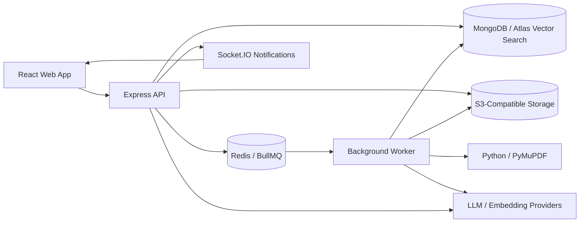
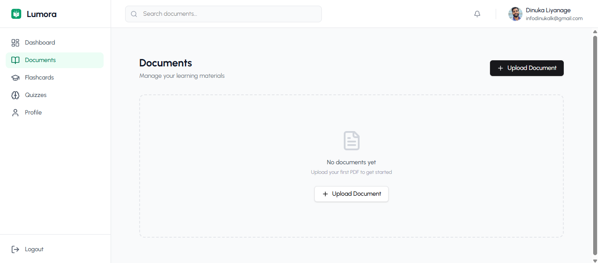
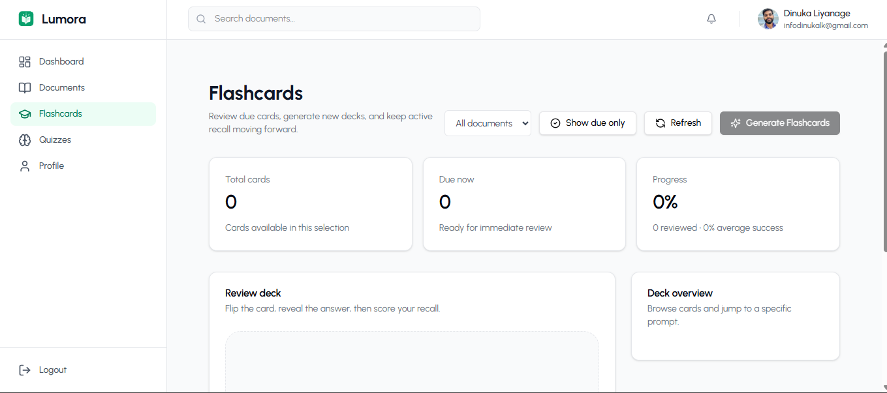
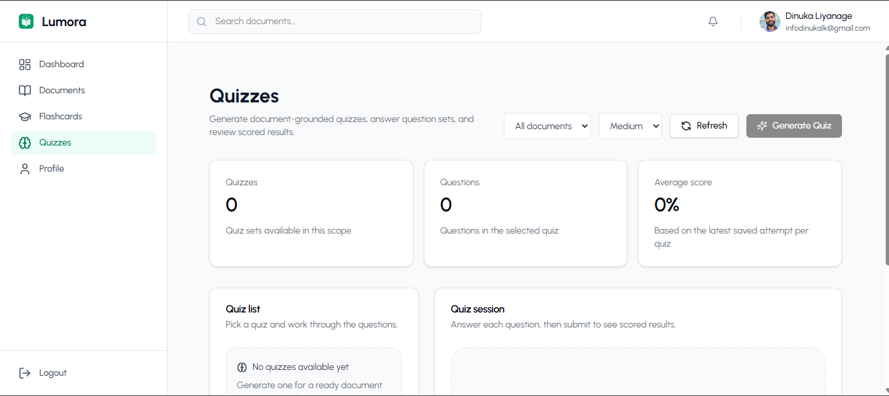
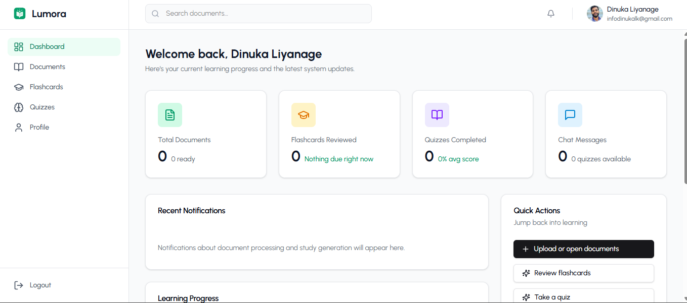

# Lumora — AI-Powered Learning Assistant

<div align="center">


<p align="center">
  <strong>Transform dense PDF documents into interactive study workspaces powered by retrieval-augmented AI, active recall flashcards, quizzes, realtime notifications, and administrative analytics.</strong>
</p>

---

</div>

## 🌟 Overview

**Lumora** turns PDF textbooks, research papers, and lecture slides into study workspaces with document-grounded chat, summaries, flashcards, and quizzes.

Its retrieval-augmented generation (RAG) pipeline extracts text with page references, splits it into chunks, and retrieves relevant passages for AI responses. Redis and BullMQ handle background processing, while Socket.IO delivers progress notifications.

## 🏗️ System Architecture


```mermaid
flowchart LR
    Web[React Web App] --> API[Express API]
    API --> DB[(MongoDB / Atlas Vector Search)]
    API --> Storage[(S3-Compatible Storage)]
    API --> Queue[(Redis / BullMQ)]
    Queue --> Worker[Background Worker]
    Worker --> PDF[Python / PyMuPDF]
    Worker --> DB
    Worker --> Storage
    Worker --> AI[LLM / Embedding Providers]
    API --> AI
    API --> Realtime[Socket.IO Notifications]
    Realtime --> Web
```

## ✨ Key Features

- **Document workspace:** Upload PDFs up to 50 MB, browse your library, and study using the PDF reader, chat, AI actions, flashcards, and quizzes.
- **Document-grounded AI:** Stream chat responses with page citations, generate summaries, extract concepts, and request explanations. Retrieval supports vector search and a lexical fallback.
- **Active learning:** Generate flashcards with spaced-repetition scheduling and multiple-choice quizzes with server-side scoring, explanations, and attempt history.
- **Learning dashboard:** Track review counts, quiz results, and recent activity.
- **Account security:** Email verification, Google OAuth, rotating refresh sessions, rate limiting, login lockouts, profile editing, and avatar uploads.
- **Admin tools:** Manage users and documents, inspect and retry background jobs, view AI usage analytics, and broadcast notifications.
- **Mobile integration:** Dedicated mobile authentication endpoints and Expo push-token support.

## 💻 Tech Stack

| Layer | Technologies |
| :--- | :--- |
| Web client | React 19, TypeScript, Vite, Redux Toolkit / RTK Query |
| UI | Tailwind CSS v4, Radix UI, Lucide React |
| API | Node.js 22, Express, TypeScript, Mongoose |
| Data and jobs | MongoDB / Atlas Vector Search, Redis, BullMQ |
| PDF and storage | Python, PyMuPDF, S3-compatible storage, Sharp |
| AI | OpenRouter; Google, HuggingFace, local Xenova, or mock embeddings |
| Notifications | Socket.IO, Expo push, SendGrid / Resend / SMTP / console email |

## 📂 Project Structure

```text
backend/
├── src/
│   ├── server.ts       # API and Socket.IO entry point
│   ├── worker.ts       # BullMQ worker entry point
│   ├── config/         # Environment and database configuration
│   ├── common/         # Middleware, email, queues, storage, utilities
│   └── modules/        # Auth, documents, AI, learning, admin, and more
├── python-worker/     # PDF extraction and Python tests
├── scripts/           # Verification scripts and admin maintenance
└── Dockerfile         # API / worker container image
frontend/lumora-ai/
├── src/
│   ├── app/            # Redux store and API setup
│   ├── components/     # Shared UI and layouts
│   ├── features/       # Feature pages and state
│   └── hooks/          # Shared React hooks
└── public/            # Static assets and screenshots
```

## 🚀 Local Development

### Prerequisites

- Node.js 22 and npm 10 or later.
- Python 3.10+ with pip.
- MongoDB (local or Atlas), Redis, and an S3-compatible document bucket such as R2 or MinIO. Atlas Vector Search is needed for vector retrieval.

### 1. Install and configure the backend

From the repository root:

```bash
cd backend
npm install
python -m pip install -r python-worker/requirements.txt
cp .env.example .env
```

Edit `backend/.env` using the configuration reference below. Replace the database, JWT, and storage placeholders before running the app.

For development without AI API keys, set:

```env
CHAT_PROVIDER=mock
EMBEDDING_PROVIDER=mock
EMAIL_PROVIDER=console
GOOGLE_OAUTH_ENABLED=false
```

Mock mode still requires MongoDB, Redis, and document storage. Console email prints verification links to the API terminal. The example environment file repeats Google OAuth settings near the bottom; keep a single `GOOGLE_OAUTH_ENABLED=false` entry unless configuring Google sign-in.

For real AI responses, set `CHAT_PROVIDER=openrouter`, provide `OPENROUTER_API_KEY`, and configure `OPENROUTER_MODEL`. Choose an embedding provider and matching model/dimensions; local Xenova embeddings require an initial model download. Configure the Atlas index described below for vector search.

### 2. Start Redis, the API, and the worker

If Redis is not already running:

```bash
docker run --name lumora-redis -p 6379:6379 -d redis:alpine
```

Run these commands in separate terminals, both from `backend/`:

```bash
# API
npm run dev:api
```

```bash
# Background processing
npm run dev:worker
```

### 3. Start the frontend

From the repository root, in another terminal:

```bash
cd frontend/lumora-ai
npm install
cp .env.example .env
npm run dev
```

Open **http://localhost:5173**. The frontend example uses `VITE_API_URL=http://localhost:5000/api`. Register an account and follow the email verification link before using features that require verification.

## 🛠️ Admin Maintenance CLI

Lumora includes a maintenance script in [`backend/scripts/admin-maintenance.ts`](backend/scripts/admin-maintenance.ts) to manage admin accounts directly from the terminal:

```bash
cd backend

# 1. List all admin users
npm run admin:manage list

# 2. Create a new verified administrator
npm run admin:manage create-admin "System Admin" admin@lumora.app "SecurePassword123!"

# 3. Reset an existing user's password and unlock account
npm run admin:manage reset-password user@lumora.app "NewSecurePassword123!"
```

---

## ⚙️ Environment Variables

### Backend Configuration Reference

See [backend/.env.example](backend/.env.example) for the complete provider and service settings.

| Variable | Type | Default | Description |
| :--- | :---: | :---: | :--- |
| `PORT` | `number` | `5000` | HTTP port for the Express server |
| `NODE_ENV` | `string` | `development` | Runtime environment (`development`, `production`, `test`) |
| `FRONTEND_URL` | `string` | `http://localhost:5173` | Allowed CORS origin for web client |
| `TRUST_PROXY` | `string` | `1` | Reverse proxy trust level for IP rate limiting |
| `MONGODB_URI` | `string` | *required* | MongoDB connection string |
| `REDIS_HOST` | `string` | `localhost` | Redis host for BullMQ queues |
| `REDIS_PORT` | `number` | `6379` | Redis port |
| `JWT_ACCESS_SECRET` | `string` | *required* | Signing key for short-lived access tokens |
| `JWT_REFRESH_SECRET` | `string` | *required* | Signing key for refresh tokens |
| `JWT_ACCESS_EXPIRATION` | `string` | `15m` | Lifetime of access token |
| `JWT_REFRESH_EXPIRATION` | `string` | `7d` | Lifetime of refresh session cookie |
| `CHAT_PROVIDER` | `enum` | `mock` | Chat backend: `openrouter` or `mock` |
| `OPENROUTER_API_KEY` | `string` | - | OpenRouter API authentication key |
| `OPENROUTER_MODEL` | `string` | `google/gemini-2.0-flash-001` | OpenRouter model ID |
| `EMBEDDING_PROVIDER` | `enum` | `mock` | Provider: `google`, `huggingface`, `local`, or `mock` |
| `EMBEDDING_DIMENSIONS` | `number` | `768` | Vector embedding dimension size |
| `GOOGLE_API_KEY` | `string` | - | Google AI Studio API key (if using Google embeddings) |
| `S3_ENDPOINT` | `string` | - | Custom endpoint for S3 / Cloudflare R2 |
| `S3_ACCESS_KEY_ID` | `string` | - | S3 access key ID |
| `S3_SECRET_ACCESS_KEY` | `string` | - | S3 secret access key |
| `S3_BUCKET_NAME` | `string` | `lumora-documents` | Private bucket for PDF storage |
| `AVATAR_S3_BUCKET_NAME` | `string` | `lumora-avatars` | Bucket for public avatar storage |
| `AVATAR_PUBLIC_BASE_URL` | `string` | - | Public URL base where avatars can be served |
| `EMAIL_PROVIDER` | `enum` | `console` | Transport: `console`, `sendgrid`, `resend`, or `smtp` |
| `GOOGLE_OAUTH_ENABLED` | `boolean` | `false` | Enable Google OAuth 2.0 login |
| `GOOGLE_OAUTH_CLIENT_ID` | `string` | - | Google Cloud OAuth Client ID |
| `GOOGLE_OAUTH_CLIENT_SECRET`| `string` | - | Google Cloud OAuth Client Secret |

### Frontend Configuration Reference

| Variable | Default | Description |
| :--- | :--- | :--- |
| `VITE_API_URL` | `http://localhost:5000/api` | Base API route URL |
| `VITE_GOOGLE_AUTH_ENABLED` | `false` | Toggles display of the "Continue with Google" button |

---

## 📡 API Reference

All routes are versioned and mounted under `/api/v1`.

### 🔐 Authentication & Profile
| Method | Endpoint | Description | Auth |
| :--- | :--- | :--- | :---: |
| `POST` | `/auth/register` | Register new local user account | Public |
| `POST` | `/auth/login` | Login with email/password (sets HttpOnly cookie) | Public |
| `POST` | `/auth/refresh` | Rotate refresh token session | Cookie |
| `POST` | `/auth/logout` | Revoke refresh token and clear cookie | Cookie |
| `GET` | `/auth/oauth/google/start` | Initiate Google OAuth 2.0 PKCE flow | Public |
| `GET` | `/auth/oauth/google/callback` | Google OAuth callback handler | Public |
| `POST` | `/auth/verification/resend` | Resend verification email | Verified |
| `GET` | `/auth/verification/verify` | Verify email token from link | Public |
| `POST` | `/auth/mobile/login` | Mobile login returning JSON tokens | Public |
| `POST` | `/auth/mobile/refresh` | Mobile token rotation via JSON body | Public |
| `GET` | `/users/me` | Get current authenticated user profile | Bearer |
| `PATCH` | `/users/me` | Update user name and preferences | Bearer |
| `POST` | `/users/me/avatar` | Upload and process avatar image (multipart) | Bearer |
| `PATCH` | `/users/me/password` | Change account password | Bearer |
| `POST` | `/users/me/push-tokens` | Register Expo push notification token | Bearer |

### 📄 Documents & Processing
| Method | Endpoint | Description | Auth |
| :--- | :--- | :--- | :---: |
| `POST` | `/documents/upload` | Upload PDF document (multipart, max 50MB) | Verified |
| `GET` | `/documents` | List paginated user documents (status filter) | Verified |
| `GET` | `/documents/:id` | Get document metadata and processing status | Verified |
| `GET` | `/documents/:id/view` | Stream PDF content for inline browser viewing | Verified |
| `DELETE` | `/documents/:id` | Delete document, chunks, and cascade study tools | Verified |

### 🤖 AI Actions & RAG Chat
| Method | Endpoint | Description | Auth |
| :--- | :--- | :--- | :---: |
| `POST` | `/ai/chat` | Document-grounded chat with SSE streaming & citations | Verified |
| `GET` | `/conversations` | List conversation history by `documentId` | Verified |
| `GET` | `/conversations/:id` | Get conversation message history | Verified |
| `POST` | `/ai/summarize-document` | Generate structured executive summary | Verified |
| `POST` | `/ai/extract-concepts` | Extract key definitions, concepts, and takeaways | Verified |
| `POST` | `/ai/explain-concept` | Deep-dive explanation for a specific concept | Verified |
| `GET` | `/ai/actions/latest` | Retrieve cached AI action artifacts for a document | Verified |

### 📚 Learning Tools (Flashcards & Quizzes)
| Method | Endpoint | Description | Auth |
| :--- | :--- | :--- | :---: |
| `POST` | `/ai/generate-flashcards` | Queue asynchronous flashcard generation job | Verified |
| `GET` | `/learning/flashcards` | List flashcards (filter by `documentId`, `dueOnly`) | Verified |
| `POST` | `/learning/flashcards/:id/review` | Submit spaced-repetition review (EASY/MEDIUM/HARD) | Verified |
| `POST` | `/ai/generate-quiz` | Queue asynchronous quiz generation job | Verified |
| `GET` | `/learning/quizzes` | List user quizzes with attempt statistics | Verified |
| `GET` | `/learning/quizzes/:id` | Get quiz questions (correct answers hidden) | Verified |
| `POST` | `/learning/quizzes/:id/submit` | Submit answers for scoring and detailed review | Verified |
| `GET` | `/learning/progress` | Get aggregate learning progress statistics | Verified |

### 🔔 Notifications & Admin Operations
| Method | Endpoint | Description | Auth |
| :--- | :--- | :--- | :---: |
| `GET` | `/notifications` | List user notifications (with unread count) | Bearer |
| `PATCH` | `/notifications/:id/read` | Mark individual notification as read | Bearer |
| `PATCH` | `/notifications/read-all` | Mark all notifications as read | Bearer |
| `GET` | `/admin/stats` | Overview dashboard statistics | Admin |
| `GET` | `/admin/analytics/usage` | Time-series AI token and request metrics | Admin |
| `GET` | `/admin/users` | Paginated user management table | Admin |
| `PATCH` | `/admin/users/:id/role` | Promote/demote user (`USER` $\leftrightarrow$ `ADMIN`) | Admin |
| `PATCH` | `/admin/users/:id/disable` | Enable or disable user account | Admin |
| `GET` | `/admin/documents` | Cross-user document management list | Admin |
| `DELETE` | `/admin/documents/:id` | Administrative document deletion | Admin |
| `GET` | `/admin/jobs` | Monitor BullMQ job states | Admin |
| `POST` | `/admin/jobs/:id/retry` | Retry failed background job | Admin |
| `POST` | `/admin/notifications/broadcast` | Broadcast system-wide notification | Admin |

---

## 🧪 Testing & Automated Verification

### Backend Unit & Integration Tests
```bash
cd backend

# Run AI service unit tests
npm run test:ai

# Run semantic chunking algorithm tests
npm run test:chunking

# Run vector search aggregation tests
npm run test:vector-search

# Run Python PyMuPDF text extraction tests
npm run test:extraction
```

### Integration verification

Run the relevant `verify:*` scripts listed in [backend/package.json](backend/package.json) against a configured development environment with the API and worker running. These cover retrieval, chat streaming, flashcards, quizzes, sessions, email verification, OAuth, and mobile authentication.

Build each application from its own directory with `npm run build`; run `npm run lint` for lint checks.

## 🚢 Production Deployment

### Runtime services

Build the frontend with `npm run build` from `frontend/lumora-ai/` and deploy its `dist/` output to a static host with SPA route rewrites. Build the backend from `backend/` and run the API (`npm run start:api`) and worker (`npm run start:worker`) as separate services.

Both backend services need access to MongoDB, Redis, object storage, and the configured AI providers. Set production JWT secrets, frontend/CORS URLs, email delivery, and optional OAuth callback URLs. The API exposes `/health`, `/livez`, and `/readyz` for service checks.

### MongoDB Atlas Vector Search Index Configuration

Create a vector search index on the `documentchunks` collection with the name specified by `VECTOR_SEARCH_INDEX_NAME` (default: `document_chunks_vector_idx`):

```json
{
  "fields": [
    {
      "type": "vector",
      "path": "embedding",
      "numDimensions": 768,
      "similarity": "cosine"
    },
    {
      "type": "filter",
      "path": "documentId"
    },
    {
      "type": "filter",
      "path": "pageNumber"
    }
  ]
}
```
Match `numDimensions` to `EMBEDDING_DIMENSIONS` and the selected model; local `Xenova/all-MiniLM-L6-v2` uses `384`.

---

### Docker & Containerized Execution

The backend contains a multi-stage [`Dockerfile`](backend/Dockerfile) bundling Node.js 22, Python 3, and PyMuPDF.

```bash
# Build the backend container image
docker build -t lumora-backend:latest ./backend

# Run API Instance
docker run -d \
  --name lumora-api \
  -p 5000:5000 \
  -e LUMORA_RUNTIME_ROLE=api \
  --env-file ./backend/.env \
  lumora-backend:latest npm run start:api

# Run Background Worker Instance
docker run -d \
  --name lumora-worker \
  -e LUMORA_RUNTIME_ROLE=worker \
  --env-file ./backend/.env \
  lumora-backend:latest npm run start:worker
```

---

## 📸 Screenshots

| Document Workspace | Interactive Flashcards |
| :---: | :---: |
|  |  |

| Quizzes | User Profile & Security |
| :---: | :---: |
|  |  |

---

## 💬 Feedback

Report bugs or suggest improvements through the repository's Issues tab. For bugs, include the steps to reproduce, expected and actual behavior, and relevant logs with credentials and personal information removed.
